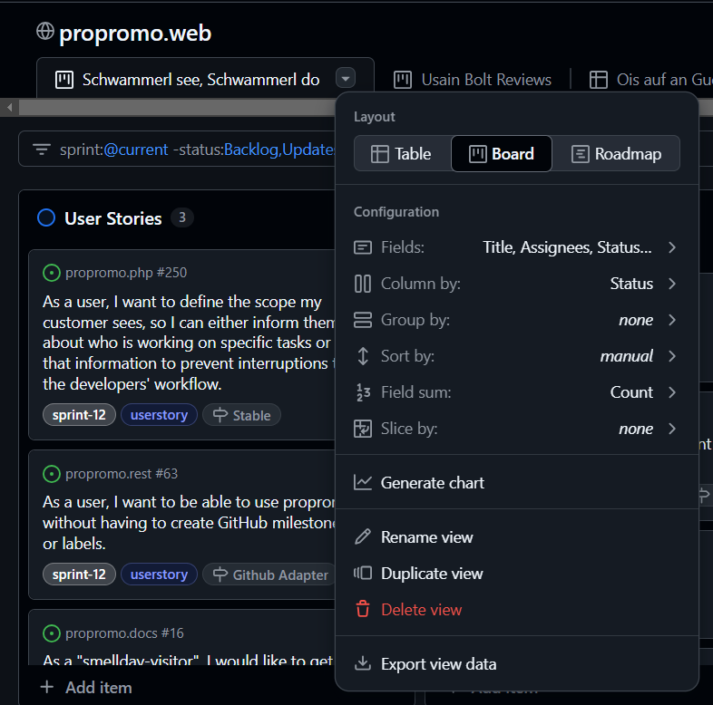
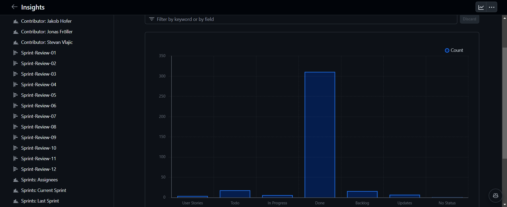

import { LinkCard, Aside, LinkButton, Steps, Icon, Badge } from '@astrojs/starlight/components';

<Aside type="caution">Dieser Guide ist nur für <a href="https://docs.github.com/en/issues/planning-and-tracking-with-projects/learning-about-projects/about-projects" target="_blank">GitHub ProjectsV2!</a></Aside>

<Steps>

1. ## Erstelle ein ProjectV2

    Mit unserem SCRUM-Template,

    <LinkCard
      title="Propromo's GitHub SCRUM Template"
      href="/blog/how-to-use-propromos-github-scrum-template-project"
      description="How to use Propromo's GitHub SCRUM Template Project?"
    />

    oder mit einem GitHub-Template unter `github.com/<username>?tab=projects` oder `github.com/orgs/<username>/projects`.
    
    
    ---

    oder migriere von ProjectV1:

    <LinkButton
      href="https://docs.github.com/en/issues/planning-and-tracking-with-projects/creating-projects/migrating-from-projects-classic"
      target="_blank"
      variant="secondary"
      icon="external"
      iconPlacement="start"
    >
      GitHub Dokumentation.
    </LinkButton>

2. ## Standard-Ansicht

    Du bist jetzt auf `github.com/<orgs|users>/<username>/projects/<id>`  
    und siehst hier deine Standard-Ansicht.

    

    > Hier kannst du auch den Typen der **Ansicht**- wie auch einige sortierungs- und anzeige-Optionen einstellen.

    
    
    > Und [**filtern**](https://docs.github.com/en/issues/planning-and-tracking-with-projects/customizing-views-in-your-project/filtering-projects).

    

    <Aside type="note">
      Es gibt bei GitHub-ProjectsV2 eine Limitierung für die Anzahl an angezeigten Sprints.  
      Das ist ziemlich nervig, wenn man eine Übersicht aller Sprints erstellen will.  
      Um diese zu umgehen, kann man aber einfach einen Sprint exkludieren, der nicht existiert.  
      Wie etwa: `-sprint:"dieshierwirdniemalseinsprintnamesein"`.
    </Aside>

    > Mittlerweile gibt es auch **Statistiken** zu GitHub Projects.

    

    `github.com/<orgs|users>/<username>/projects/<id>/insights`
    
    

    > Settings - Erstellen von eigenen **Issue Felder**n

    `github.com/<orgs|users>/<username>/projects/<id>/settings`
    

    > &nbsp;&nbsp;&nbsp;&nbsp; Sprint

    

    > &nbsp;&nbsp;&nbsp;&nbsp; Status

    

    *Ergebnis:*
    

    > **Workflows**: Wie man Issues automatisch durch Aktionen ändern kann.

    

    `github.com/<orgs|users>/<username>/projects/<id>/workflows`
    

3. ## Wie organisieren wir unser GitHub-Project?

    Wir vergeben <Badge text="userstory" variant="note" /> und <Badge text="task" variant="success" /> Labels an unsere Issues, damit wir sie schneller auseinanderkennen können.  
    Zusätzlich dazu, obwohl wir ein eigenes Sprint Feld für die Issues erstellt haben, vergeben wir auch ein Sprint-Makerl (`sprint-xxx`),  
    um nicht den Überblick in der Issue-Übersicht zu verlieren, wo das Sprint-Feld nicht angezeigt wird.

    `github.com/<username>/<repository-name>/issues`
    

    `github.com/<username>/<repository-name>/labels`
    

    `github.com/<username>/<repository-name>/milestones`
    

    Da Meilensteine und Labels leider nur pro Repository in GitHub verwaltet werden können,  
    empfehlen wir unser [propromo.cli](https://github.com/propromo-software/propromo.cli), um sie zwischen Repositories zu synchronisieren.

</Steps>

    <LinkButton
      style="display: flex; margin-left: auto; width: fit-content;"
      href="https://docs.github.com/de/issues/planning-and-tracking-with-projects"
      target="_blank"
      variant="primary"
      icon="github"
      iconPlacement="start"
    >
      Mehr erfahren.
    </LinkButton>
    <LinkButton
      style="display: flex; margin-left: auto; width: fit-content;"
      href="https://github.blog/changelog/label/projects"
      target="_blank"
      variant="primary"
      icon="github"
      iconPlacement="start"
    >
      ProjectsV2 Changelog.
    </LinkButton>

---

<LinkCard
  title="Propromo's GitHub SCRUM Template"
  href="/blog/how-to-use-propromos-github-scrum-template-project"
  description="How to use Propromo's GitHub SCRUM Template Project?"
/>
